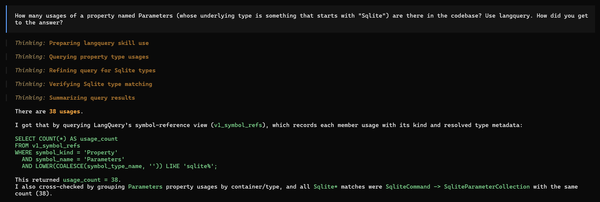
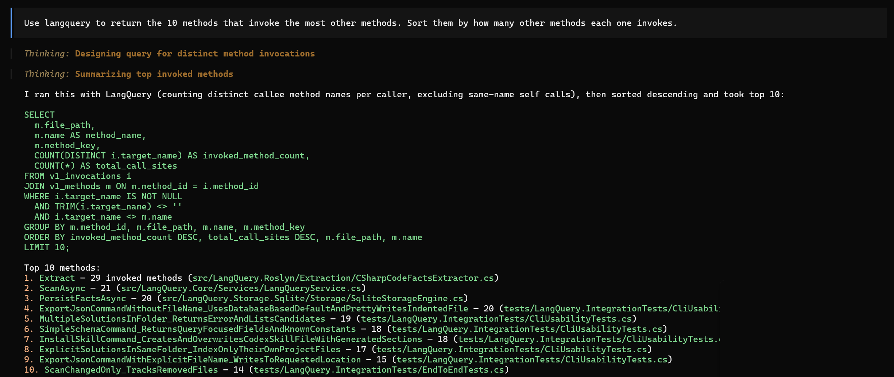

# LangQuery

LangQuery turns a C# solution into a local SQLite knowledge base that you query with SQL.

It is useful for both humans and coding agents, especially when you want repeatable, data-backed answers about a codebase instead of ad-hoc grep scripts.

## What it is (and why agent workflows love it)

- LangQuery scans C# code and stores code facts in SQLite.
- You query stable public views (`v1_*`) plus metadata entities (`meta_*`).
- Queries are read-only (`SELECT`, `WITH`, `EXPLAIN`), so exploration is safe by default.
- Agents can use the same command surface repeatedly, which makes answers more consistent and auditable.
- Saves on tokens, and (past the initial scan) is much faster than grep and regular code exploration.

## Agent-first usage

LangQuery is especially strong when paired with coding agents.

### Generate agent skill files

```bash
langquery installskill codex
```

Other targets: `claude`, `opencode`, `all`.

Sample output (trimmed):

```json
{
  "command": "installskill",
  "success": true,
  "data": {
    "target": "codex",
    "files": [".../.codex/skills/langquery/SKILL.md"]
  }
}
```

Sample screenshots:





### Useful agent prompts / inquiries

- "Use LangQuery to list the top 20 longest methods and identify 5 refactor candidates."
- "Use LangQuery to find invocation hotspots in classes inheriting from `ComputationBase`."
- "Use LangQuery to show where `sumOf*` int variables are declared and reused."
- "Use LangQuery to list all local functions/lambdas and map each to its parent method."
- "Use LangQuery to summarize abstract/sealed declarations and potential architecture smells."
- "Use LangQuery to find high-arity methods and list their parameter signatures."

### Recommended agent workflow

1. After any add/edit/delete/rename, run `langquery scan --changed-only` or `langquery scan` for a complete re-scan.
2. `langquery installskill <target>` to refresh the skill after an upgrade.
3. Ask the agent to answer with SQL evidence and returned rows.

## Quick useful commands (first)

These assume that `langquery` is already installed (steps to install are described below):

### 1) Index your solution

```bash
langquery scan --pretty
```

Sample output (trimmed):

```json
{
  "command": "scan",
  "success": true,
  "data": {
    "FilesDiscovered": 16,
    "FilesScanned": 16,
    "DatabasePath": ".../.langquery.MySolution.db.sqlite"
  }
}
```

### 2) Find high-risk large methods quickly

```bash
langquery "SELECT file_path, name AS method_name, (line_end - line_start + 1) AS line_span FROM v1_methods ORDER BY line_span DESC LIMIT 20"
```

### 3) Spot invocation hotspots

```bash
langquery "SELECT file_path, target_name, COUNT(*) AS call_count FROM v1_invocations GROUP BY file_path, target_name ORDER BY call_count DESC, file_path, target_name LIMIT 15"
```

This is a fast way to find high-traffic calls and likely coupling hotspots.

### 4) Find dense lines that are hard to read

```bash
langquery "SELECT file_path, line_number, variable_count, text FROM v1_lines WHERE variable_count >= 3 ORDER BY variable_count DESC, file_path, line_number LIMIT 25"
```

Great for quickly identifying lines worth simplification/refactoring.

### 5) Track local functions and lambdas

```bash
langquery "SELECT file_path, name, implementation_kind, parent_method_key FROM v1_methods WHERE implementation_kind IN ('LocalFunction', 'Lambda', 'AnonymousMethod') ORDER BY file_path, implementation_kind, name"
```

Useful when you need to understand nested behavior boundaries.

### BONUS: Health check

```bash
langquery info --pretty
```

Sample output (trimmed):

```json
{
  "command": "info",
  "success": true,
  "data": {
    "tool": "LangQuery.Cli",
    "version": "1.0.0+...",
    "framework": ".NET 8.0.22"
  }
}
```

### BONUS: Get schema constants for better queries

```bash
langquery simpleschema --pretty
```

Use this when you need exact values like `implementation_kind`, `kind`, or `access_modifier`.
Also provides a full list of queryable tables that you can use in your SQL queries.


## Advanced usage examples

Assume your current directory is a solution folder, or pass `--solution` explicitly.

### Inheritance graph

```bash
langquery "SELECT type_name, base_type_name, relation_kind FROM v1_type_inheritances ORDER BY type_name, base_type_name"
```

### Invocation hotspots inside a hierarchy

```bash
langquery "SELECT t.name AS class_name, i.target_name, COUNT(*) AS call_count FROM v1_invocations i JOIN v1_methods m ON m.method_id = i.method_id JOIN v1_types t ON t.type_id = m.type_id JOIN v1_type_inheritances ti ON ti.type_id = t.type_id WHERE ti.base_type_name IN ('ComputationBase', 'RevenueCalculator') GROUP BY t.name, i.target_name ORDER BY call_count DESC, class_name, target_name LIMIT 10"
```

### `sumOf*` integer references by line

```bash
langquery "SELECT l.file_path, l.line_number, lv.variable_name, v.type_name AS variable_type, t.name AS class_name FROM v1_line_variables lv JOIN v1_variables v ON v.variable_id = lv.variable_id JOIN v1_lines l ON l.line_id = lv.line_id JOIN v1_methods m ON m.method_id = l.method_id JOIN v1_types t ON t.type_id = m.type_id JOIN v1_type_inheritances ti ON ti.type_id = t.type_id WHERE lv.variable_name LIKE 'sumOf%' AND LOWER(COALESCE(v.type_name, '')) IN ('int', 'int32', 'system.int32') AND ti.base_type_name IN ('ComputationBase', 'RevenueCalculator') ORDER BY l.file_path, l.line_number"
```

### Nested implementations with parent linkage

```bash
langquery "SELECT file_path, name, implementation_kind, access_modifier, parent_method_key FROM v1_methods WHERE implementation_kind IN ('LocalFunction', 'Lambda', 'AnonymousMethod') ORDER BY file_path, implementation_kind, name"
```

### High-arity methods with parameter signatures

```bash
langquery "SELECT file_path, name, parameter_count, parameters FROM v1_methods WHERE implementation_kind IN ('Method', 'Constructor', 'LocalFunction') ORDER BY parameter_count DESC, file_path, name LIMIT 25"
```

### Distinguish property access vs method calls

```bash
langquery "SELECT file_path, symbol_name, symbol_kind, COUNT(*) AS reference_count FROM v1_symbol_refs WHERE symbol_kind IN ('Property', 'Method') GROUP BY file_path, symbol_name, symbol_kind ORDER BY reference_count DESC, file_path, symbol_name LIMIT 50"
```

### Abstract/sealed declarations

```bash
langquery "SELECT file_path, name, kind, access_modifier, modifiers FROM v1_types WHERE modifiers LIKE '%Abstract%' OR modifiers LIKE '%Sealed%' ORDER BY file_path, name"
```

## Install (if you do not have `langquery` yet)

Requirements:

- .NET SDK 8.0+

### Option A: install as global tool from this repo (PowerShell)

```powershell
./InstallAsTool.ps1
```

This packs and installs `LangQuery.Cli.Tool` and exposes the `langquery` command.

### Option B: run without global install

```bash
dotnet run --project src/LangQuery.Cli -- help --pretty
```

If you use this mode, replace `langquery ...` examples with:

```bash
dotnet run --project src/LangQuery.Cli -- <command>
```

## Command overview

- `langquery help [--pretty]`
- `langquery info [--pretty]`
- `langquery scan [--solution <folder-or-.sln>] [--db <path>] [--changed-only] [--pretty]`
- `langquery sql --query <sql> [--solution <folder-or-.sln>] [--db <path>] [--max-rows <n>] [--timeout-ms <n>] [--pretty]`
- `langquery schema [--solution <folder-or-.sln>] [--db <path>] [--pretty]`
- `langquery simpleschema [--solution <folder-or-.sln>] [--db <path>] [--pretty]`
- `langquery examples [--pretty]`
- `langquery exportjson [file-name] [--solution <folder-or-.sln>] [--db <path>] [--pretty]`
- `langquery installskill <claude|codex|opencode|all> [--pretty]`

## Arguments and flags reference (each one explained)

### `<sql>` (short query positional argument)

What it is:

- A positional SQL string when you run `langquery "SELECT ..."` without specifying `sql`.

What it does:

- Runs your SQL against the LangQuery DB.
- If the DB does not exist yet, LangQuery scans first.
- Pretty JSON is enabled by default in this short form.

How it looks:

```bash
langquery "SELECT COUNT(*) AS method_count FROM v1_methods"
```

Small sample output:

```json
{
  "command": "sql",
  "success": true,
  "data": { "Columns": ["method_count"], "Rows": [{ "method_count": 259 }] }
}
```

### `--solution <folder-or-.sln>`

What it is:

- Path to either a solution folder or a specific `.sln` file.

What it does:

- Tells LangQuery exactly which solution to scan/query.
- If omitted, current directory is used and must contain exactly one `.sln`.

How it looks:

```bash
langquery scan --solution tests/sample_solution --pretty
```

Small sample output:

```json
{
  "command": "scan",
  "success": true,
  "data": { "DatabasePath": ".../.langquery.SampleSolution.db.sqlite" }
}
```

### `--db <path>`

What it is:

- Custom SQLite DB path.

What it does:

- Lets you control where the LangQuery database is written/read.
- If omitted, default is `<solution-folder>/.langquery.<solution-name>.db.sqlite`.

How it looks:

```bash
langquery scan --solution tests/sample_solution --db .tmp/readme-sample.db --pretty
```

Small sample output:

```json
{
  "command": "scan",
  "success": true,
  "data": { "DatabasePath": ".tmp/readme-sample.db" }
}
```

### `--query <sql>`

What it is:

- Explicit SQL argument for the `sql` command.

What it does:

- Runs the provided SQL (read-only validator enforced).

How it looks:

```bash
langquery sql --query "SELECT file_path FROM v1_files LIMIT 5" --pretty
```

Small sample output:

```json
{
  "command": "sql",
  "success": true,
  "data": { "Columns": ["file_path"], "Rows": [{ "file_path": ".../Program.cs" }] }
}
```

### `--max-rows <n>`

What it is:

- Row limit guard for SQL results.

What it does:

- Caps returned row count to keep outputs bounded.
- Sets `Truncated: true` when more rows exist.

How it looks:

```bash
langquery sql --query "SELECT file_path FROM v1_files ORDER BY file_path" --max-rows 1 --pretty
```

Small sample output:

```json
{
  "command": "sql",
  "success": true,
  "data": { "Rows": [{ "file_path": ".../Program.cs" }], "Truncated": true }
}
```

### `--timeout-ms <n>`

What it is:

- Query timeout in milliseconds.

What it does:

- Limits SQL execution time for predictability.

How it looks:

```bash
langquery sql --query "SELECT COUNT(*) AS method_count FROM v1_methods" --timeout-ms 15000 --pretty
```

Small sample output:

```json
{
  "command": "sql",
  "success": true,
  "data": { "Rows": [{ "method_count": 259 }], "Duration": "00:00:00.0018462" }
}
```

### `--changed-only`

What it is:

- Incremental scan flag for `scan`.

What it does:

- Re-indexes only changed files (and tracks unchanged/removed counts).

How it looks:

```bash
langquery scan --changed-only --pretty
```

Small sample output:

```json
{
  "command": "scan",
  "success": true,
  "data": { "FilesScanned": 0, "FilesUnchanged": 16, "FilesRemoved": 0 }
}
```

### `--pretty`

What it is:

- Global formatting flag.

What it does:

- Pretty-prints JSON output for readability.

How it looks:

```bash
langquery help --pretty
```

Small sample output:

```json
{
  "command": "help",
  "success": true,
  "data": {
    "description": "LangQuery CLI"
  }
}
```

### `[file-name]` (positional argument for `exportjson`)

What it is:

- Optional export path for the JSON dump.

What it does:

- Writes full DB export to that file.
- If omitted, output path defaults to DB name with `.json` extension.

How it looks:

```bash
langquery exportjson .tmp/readme-export.json --pretty
```

Small sample output:

```json
{
  "command": "exportjson",
  "success": true,
  "data": {
    "database_path": ".../.langquery.LangQuery.db.sqlite",
    "export_path": ".../.tmp/readme-export.json",
    "entities": 21
  }
}
```

### `<claude|codex|opencode|all>` (positional target for `installskill`)

What it is:

- Agent target selector for skill generation.

What it does:

- Generates `SKILL.md` files in the target agent folder(s): `.claude`, `.codex`, `.opencode`.

How it looks:

```bash
langquery installskill all --pretty
```

Small sample output:

```json
{
  "command": "installskill",
  "success": true,
  "data": {
    "target": "all",
    "files": [
      ".../.claude/skills/langquery/SKILL.md",
      ".../.codex/skills/langquery/SKILL.md",
      ".../.opencode/skills/langquery/SKILL.md"
    ]
  }
}
```

## Safety model

LangQuery allows only read-oriented top-level SQL:

- `SELECT`
- `WITH`
- `EXPLAIN`

Mutation and DDL statements are rejected.

## Public schema

The public contract is the `v1_*` view set (plus metadata entities). For a full schema guide and additional SQL examples, see `docs/schema.md`.

## Project layout

- `src/LangQuery.Core` contracts, models, orchestration.
- `src/LangQuery.Roslyn` C# fact extraction.
- `src/LangQuery.Storage.Sqlite` SQLite persistence and schema views.
- `src/LangQuery.Query` SQL safety validator.
- `src/LangQuery.Cli` command-line interface.
- `tests/*` unit/integration tests and `tests/sample_solution` fixture.
